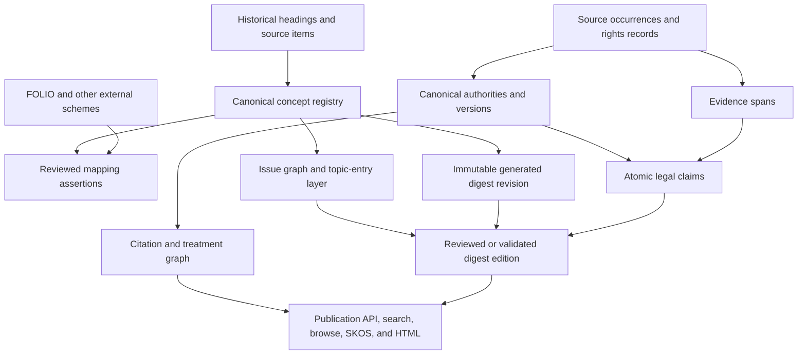

# FOLIO-Aligned Digest Architecture — All 137,139 Digests Generated — 2026-07-29

> **Document set:** [Runner proposals](2026-07-29-RUNNER_V3_PROPOSALS.md) ·
> [Architecture](2026-07-29-ARCHITECTURE_FOLIO_ALIGNED.md) ·
> [FOLIO/SKOS](2026-07-29-FOLIO_SKOS.md) ·
> [Research audit](2026-07-29-RESEARCH_METHOD_AUDIT.md) ·
> [Atomic plan](2026-07-29-TODO.md)
>
> **Evidence snapshot:** runner
> `265a8610695067d825392751ffdb3e5932a0aefd`; site
> `3e49d34387d2d5ce20930cc158d01dc5c725b071`; measurement cutoff
> `2026-07-29T18:03:54Z`.
>
> **Verification:** re-verified against code on 2026-07-30 — see the
> [verification addendum](../2026-07-30-verification-addendum.md) for
> confirmations, corrections, and drift (the pinned site commit no longer
> resolves after a history squash).

## Scope and status convention

This is the architecture for preserving and upgrading a completed,
current-format generation of all **137,139 U.S. canonical issue records**. It
does not assume that each record has already survived issue-versus-scaffold
adjudication. It does not recommend deleting the generated work or silently
regenerating it. It inserts stable identity, evidence, editorial, graph, and
release layers between the raw generation and the public product.

The completed-corpus premise is a planning assumption. The repository snapshot
measured on 2026-07-29 contains 1,705 digest files, not 137,139. Measurements
from that snapshot identify implementation behavior; they are not silently
extrapolated into invented full-corpus totals.

The 137,139-record v3 ledger itself has 36 Areas of Law and ten objectives.
Its path-depth distribution is 2,826 at depth 3; 22,913 at depth 4; 58,772 at
depth 5; 41,276 at depth 6; 10,166 at depth 7; and 1,186 at depth 8. The
measured physical corpus has 41 roots—31 current doctrinal roots and ten legacy
composite roots—and lacks five of the 36 v3 doctrinal roots. The migration must
reconcile those systems instead of naively publishing 46 roots.

The only status values in this document are **DONE** and **PENDING**.

## Architectural position

The project has three distinct intellectual products and must represent them as
three distinct layers:

1. **Issue vocabulary** — the controlled concepts lawyers use to enter,
   browse, classify, and connect doctrine.
2. **Digest editions** — sourced, reviewed explanations of those issues.
3. **Authority and treatment graph** — cases, enactments, regulations, rules,
   versions, citations, and treatments.

FOLIO supplies federation anchors. It does not replace the local issue registry,
prove a local mapping, supply the digest content, or provide a citator.

The precise description is:

> A jurisdiction-specific, open legal issue registry with evidence-backed
> digest editions, aligned to shared vocabularies through reviewed mappings and
> published through stable identifiers.

## Current implementation baseline

### Implemented capabilities — DONE

| Capability                                            | Evidence                                                                 |
| ----------------------------------------------------- | ------------------------------------------------------------------------ |
| One operational record per canonical issue            | `key_digest/issues_v3.jsonl`; 137,139 records                            |
| Many-to-one item preservation                         | Records retain sorted `item_ids` and `n_items`; 156,802 item memberships |
| Stable local UUID carried through generation          | `issue_id` in issue records and most current frontmatter                 |
| Primary doctrinal and objective paths                 | `areas_of_law_path` and `objectives_path`                                |
| FOLIO area/objective anchor normalization             | `key_digest/folio_base.py`; `key_digest/build_issues_v3.py`              |
| Conflict detection during item-to-issue derivation    | `_merge_folio()` and `derive()` fail on conflicting anchors/paths        |
| SKOS-shaped frontmatter                               | `key_digest/skos_okf.py`                                                 |
| W3ID namespace and JSON-LD publication                | `digest-law-us/src/lib/skos.ts` and `/skos.jsonld`                       |
| Separate source, audit, index, and run-manifest files | Current bundle contract and site collections                             |

### Missing capabilities — PENDING

| Capability                                                  | Why it is not DONE                                                                                                                       |
| ----------------------------------------------------------- | ---------------------------------------------------------------------------------------------------------------------------------------- |
| Stable public concept identity                              | Public IRIs are derived from mutable paths rather than UUIDs.                                                                            |
| Complete authoritative item-level archive in the repository | `issues_v3.jsonl` is a derivative; the full item-level input and a real build manifest are not present.                                  |
| Immutable generation plus curated editions                  | Current Markdown is both generated artifact and publication source.                                                                      |
| Concept typing                                              | Headings, practice topics, issues, doctrines, statutes, authorities, controversies, and scaffolds are not represented as distinct kinds. |
| Polyhierarchy                                               | The measured 1,705-digest snapshot has zero concepts with multiple explicit broader values.                                              |
| Associative graph                                           | Only 159 measured digests carry any `related` value.                                                                                     |
| Reviewed external mappings                                  | FOLIO dominates; West 1914 has eight populated mappings and the other declared schemes have none.                                        |
| Multilingual/jurisdictional architecture                    | Site language tags are hardcoded to English and the local scheme is U.S.-specific.                                                       |
| Claim-to-evidence graph                                     | Sources exist at bundle level; propositions do not resolve to immutable source spans.                                                    |
| Authority/treatment graph                                   | No citator data model or updating pipeline exists.                                                                                       |
| Completed-corpus serving architecture                       | The present all-static build is already a 12 GB heap/27-minute operation at 1,705 digests.                                               |

## Target layered architecture



Each arrow is a persisted, versioned relation. No downstream layer may infer
identity by parsing a label or directory path.

## Required architecture decisions

### A-01 — Immutable canonical concept registry

**State: PENDING**

The registry is the source of truth for concept identity. A minimal record is:

```json
{
  "concept_id": "2b8aeb0b-9919-56b4-8c8e-a83e131707a5",
  "public_id": "2b8aeb0b991956b48c8ea83e131707a5",
  "concept_kind": "issue",
  "editorial_status": "candidate",
  "jurisdiction": "US",
  "preferred_labels": { "en": "Log books as evidence" },
  "alternate_labels": { "en": [] },
  "historical_labels": { "en": [] },
  "definition_refs": [],
  "scope_note_refs": [],
  "created_in_release": "generated-2026-07-29",
  "deprecated_in_release": null,
  "replaced_by": []
}
```

**Evidence and cause.** UUIDs already exist in the operational issue file, but
`key_digest/skos_okf.py:147-151` treats UUID only as provenance and derives the
concept URN from the path. `digest-law-us/src/lib/skos.ts:22-24` then derives
the W3ID IRI from the slug path. Identity and arrangement were combined for
convenient materialization.

**Required remediation.**

- Import all 137,139 issue UUIDs as immutable identities.
- Assign concept kinds and editorial statuses separately.
- Mint public IRIs from `public_id`.
- Preserve every generated path as an alias record scoped to its release.

**Acceptance criteria.**

- A rename, translation, merge, split, or reparent operation never changes the
  surviving concept's public IRI.
- No active concepts share an identity or current route.
- Every merged or deprecated concept remains dereferenceable and names its
  disposition.

### A-02 — Immutable generated revisions and curated editions

**State: PENDING**

For each assumed generated bundle, preserve:

- raw model output;
- normalized current-format bundle;
- generation manifest;
- source acquisition records;
- prompt/model/configuration identifiers;
- an immutable revision ID.

A curated edition is a different object:

```json
{
  "edition_id": "digest-edition:...",
  "concept_id": "...",
  "based_on_revision": "generation:...",
  "status": "reviewed",
  "effective_as_of": "2026-07-29",
  "jurisdiction_scope": ["US"],
  "claims": ["claim:..."],
  "review_events": ["review:..."],
  "supersedes": null
}
```

**Evidence and cause.** The worker writes output directly to the canonical
topic path (`runner/run_key_digest_research_workers.py:1362-1412`) and the site
globs that path as public content (`src/content.config.ts:51-66`). A directory
therefore has no explicit generated/reviewed distinction.

**Acceptance criteria.**

- The generated corpus can be reproduced byte-for-byte after an editorial
  correction.
- Public promotion is explicit and reversible.
- Every public paragraph has a revision and review lineage.
- Re-running research creates a sibling revision, not an overwrite.

### A-03 — Source occurrence, source object, evidence span, and rights record

**State: PENDING**

Do not treat a filename as a source identity. Represent:

1. **Source occurrence** — the URL/query/channel result seen during a run.
2. **Source object** — the retained bytes, content hash, media type, and
   normalized text.
3. **Evidence span** — an immutable byte/character locator within a source
   object.
4. **Rights record** — rights basis and redistribution disposition.
5. **Safety record** — privacy, sensitivity, redaction, and republication
   disposition.

`source_kind` is a governed enum derived from the document itself—not an
arbitrary frontmatter string or domain default—and distinguishes opinions,
orders, briefs, declarations, other filings, statutes, regulations, agency
materials, and secondary sources.

**Evidence and cause.**

- Positional source-to-file assignment can drift after a rejection:
  `runner/run_key_digest_research_workers.py:1152-1182` versus
  `:1289-1313`.
- `run.json` inventories paths and hashes but reviewer changes leave stale
  state.
- The public source schema has no mandatory license or rights disposition.
- The 7,436 measured source files contain 1,090 duplicate body copies and
  526,940,196 reclaimable body bytes (32.67%). One CourtListener RECAP
  declaration URL appears in 64 unrelated issue directories.
- Zero measured source frontmatter records declare license, rights, copyright,
  named provenance, or language; only eight declare jurisdiction.

**Acceptance criteria.**

- Source identity is content- and record-based, never positional.
- Every evidence span resolves against an exact source hash.
- Every public source has separate redistribution and privacy/sensitivity
  dispositions.
- A source may support many concepts without duplicating bytes or provenance.

### A-04 — Atomic legal claim model

**State: PENDING**

Digest prose must be rendered from or accompanied by structured claims:

```json
{
  "claim_id": "claim:...",
  "concept_id": "...",
  "claim_kind": "rule",
  "text": "...",
  "jurisdiction": "US-CA",
  "valid_time": { "from": null, "to": null },
  "support": [
    {
      "evidence_span_id": "span:...",
      "support_kind": "direct",
      "authority_id": "authority:..."
    }
  ],
  "contrary_support": [],
  "review_status": "validated"
}
```

**Evidence and cause.** The current 40-bundle evaluation scored stage 3 citation
support at 3.4/10. Current manifests know sources and files but not propositions
or supporting spans. Bundle-level source presence was substituted for
claim-level proof.

**Acceptance criteria.**

- Every material published legal claim resolves to one or more source spans.
- Editorial synthesis is a typed inference over supported premises, not an
  exception to the evidence rule.
- Unsupported leads and open questions remain quarantined from published legal
  propositions.
- Jurisdiction and temporal scope are queryable.
- A changed or withdrawn authority automatically identifies dependent claims.

### A-05 — Topic Entry Layer and concept kinds

**State: PENDING**

The top-level user experience should be a professionally recognizable
approximately 600-topic entry layer, triangulated from public law-library
research guides, open classifications, historical sources, modern public law,
and specialist review. It is an access layer, not a metaphysical hierarchy and
not evidence of institutional endorsement.

Required concept kinds:

| Kind                     | Definition                                                                      | Publication rule                         |
| ------------------------ | ------------------------------------------------------------------------------- | ---------------------------------------- |
| `topic`                  | Lawyer-facing entry area or practice subject                                    | May organize issues; not itself a claim  |
| `issue`                  | Recurring legal question or point of law                                        | Core digest unit                         |
| `doctrine_or_test`       | Named rule, test, standard, element, or defense                                 | May be an issue or narrower concept      |
| `statutory_regime`       | Statute/regulatory program used as a research entry                             | Must link to authority versions          |
| `authority`              | Case, statute, regulation, rule, treaty, restatement, or similar source         | Lives primarily in authority graph       |
| `controversy_collection` | Event- or dispute-centered discovery collection                                 | Must point to issues and authorities     |
| `scaffold`               | Introduction, scope, general principles, forms, tables, or similar organization | Cannot be published as a validated issue |

**Evidence and cause.** Current generation begins from inherited heading paths.
The prefix materialization preserves context but does not prove every prefix is
a legal issue. The schema has one `type: legal_issue` for almost the entire
measured corpus (1,704 of 1,705).

**Acceptance criteria.**

- Every concept has one adjudicated kind.
- The entry-topic provenance and normalization decisions are public.
- Scaffold classifications are reviewable and reversible.
- Famous authorities such as a case name do not become issues merely because
  they are searchable; recurring questions derived from them may.

### A-06 — Polyhierarchical and associative issue graph

**State: PENDING**

Store graph assertions independently of filesystem placement:

```json
{
  "assertion_id": "relation:...",
  "subject": "concept:...",
  "predicate": "skos:broader",
  "object": "concept:...",
  "scheme_id": "https://w3id.org/digest-law/scheme/us",
  "asserted_in_release": "https://w3id.org/digest-law/release/us/2027.1",
  "primary_for_browse": false,
  "provenance": "editorial",
  "reviewer": "...",
  "status": "approved"
}
```

**Evidence and cause.** The measured corpus has no multi-broader concept and
only 159 concepts with a `related` value. `key_digest/skos_okf.py:91-96`
generates one structural parent. The site additionally forces the folder parent
into `skos:broader` at `src/lib/skos.ts:74-83`.

**Acceptance criteria.**

- Multiple broader relations are allowed without duplicating the concept.
- The UI distinguishes a primary browse path from other valid placements.
- `skos:related` assertions are symmetric and pass editorial policy checks.
- Hierarchical cycles fail validation.

### A-07 — Reviewed external mapping assertions

**State: PENDING**

FOLIO and other external resources are mapping targets. Each mapping requires:

```json
{
  "local_concept_id": "...",
  "target_iri": "https://folio.openlegalstandard.org/R...",
  "target_resource": "FOLIO",
  "target_rdf_type": "owl:Class",
  "target_snapshot": "git:<commit>",
  "compatibility_policy": "project_mapping_assertion",
  "relation": "digest:mapsToFolioClass",
  "confidence": 0.94,
  "method": "editorial",
  "evidence_note": "...",
  "review_status": "approved"
}
```

**Evidence and cause.**

- The derivative file has FOLIO anchors for all issues, but the actual
  `folio_build_manifest.json` is absent; only an example is present.
- `key_digest/skos_okf.py:99-114` puts both area and objective anchors into
  `closeMatch`, even though those facets need not be semantically equivalent to
  the issue.
- The pinned FOLIO artifact represents its `R*` resources as OWL classes, not
  as documented members of a SKOS ConceptScheme.
- The measured digest frontmatter has populated FOLIO mappings on 1,620
  digests, West 1914 on eight, and none for SALI/LMSS, LIST, or EuroVoc.

**Acceptance criteria.**

- No mapping relation is inferred merely because an anchor exists.
- FOLIO snapshot commit and ontology hash are present in every release.
- A `skos:*Match` is emitted only to an approved pinned SKOS proxy/view or
  under an explicit reviewed OWL/SKOS dual-typing policy; otherwise the project
  mapping assertion preserves the OWL-class target.
- Exact/close/broad/narrow/related mapping semantics are separately reviewable.
- A target scheme update never silently changes local mappings.

### A-08 — Canonical authority and version graph

**State: PENDING**

Authorities require identity and temporal/version modeling separate from source
files:

- court, docket, opinion, reporter citation, precedential status;
- code title/section, enactment, amendment, effective period;
- regulation part/section, edition and effective period;
- citation edges and treatment events;
- official and alternative source manifestations.

**Evidence and cause.** Current indexes derive rows from retained source
classification and citation extraction, but no normalized authority registry
or treatment graph exists. The project was designed as issue research, not a
citator.

**Acceptance criteria.**

- Duplicate citations resolve to one authority identity.
- Version-sensitive claims point to the applicable authority version.
- Subsequent history and treatment have evidence spans and update timestamps.
- Citator coverage is measured independently from digest quality.

### A-09 — Jurisdiction and language packages

**State: PENDING**

The reusable unit for international replication is a **jurisdiction package**,
not a translated U.S. tree:

```text
jurisdiction-package/
  manifest.json
  authority-types.json
  source-policy.json
  topic-entry-layer.json
  concept-registry.jsonl
  relation-assertions.jsonl
  mappings.jsonl
  labels/{language}.jsonl
  validation-policy.json
  review-roles.json
```

Each package defines its own legal sources, authority hierarchy, courts,
legislative system, temporal rules, languages, and editorial panel. Shared
concepts are connected through mappings rather than forced identity.

**Evidence and cause.** The site emits every label and note with
`@language: "en"` (`src/lib/skos.ts:30-32`), uses a U.S. namespace, and assumes
one path tree. Localization was treated as a future display concern rather than
part of concept data.

**Acceptance criteria.**

- Language tags originate in the registry, never from a hardcoded exporter
  default.
- SKOS S14 is enforced per resource and BCP 47 language tag; scheme-wide
  collisions remain a separate editorial report.
- Concepts may be jurisdiction-specific, shared, or mapped without declaring
  legal equivalence.
- Local specialists control legal definitions and mappings.

### A-10 — Release store, APIs, and scalable publication

**State: PENDING**

The completed corpus should be published from immutable release artifacts:

- registry and graph database;
- content-addressed source object store;
- claim/evidence index;
- authority/treatment index;
- search index;
- static metadata exports;
- HTML/API renderer;
- signed release manifest.

**Evidence and cause.** At 1,705 digests the current static build needs a 12 GB
heap, about 27 minutes, 20,900 pages, 29,667 files, and 1.8 GB output. Code CI
has a three-minute timeout and no corpus checkout. Monolithic static generation
was adequate for the first public corpus but is not a completed-corpus
architecture.

**Acceptance criteria.**

- One issue update does not rebuild unrelated content.
- Stable concept IRIs dereference in HTML and RDF serializations.
- Release search, graph, and content versions are consistent.
- Rollback changes a release pointer, not stored history.
- Full-scale latency, availability, build, and cost budgets are documented and
  met.

## Migration architecture for the assumed completed corpus

### Phase 0 — Freeze and inventory

**State: PENDING**

1. Copy the completed generated tree into immutable object storage.
2. Hash all files and bind every directory to issue UUID.
3. Record generation configuration, model, prompts, repositories, and external
   snapshots.
4. Produce discrepancy reports; do not repair while measuring.

Exit: exactly 137,139 bundle identities and a reproducible content manifest.

### Phase 1 — Normalize without destroying

**State: PENDING**

1. Import files as immutable generated revisions.
2. Build source objects and rights records.
3. Reconcile source metadata, disk files, evidence buckets, and manifests.
4. Preserve unresolved ambiguities as explicit errors.

Exit: every retained byte and metadata assertion is attributable or quarantined.

### Phase 2 — Build the concept and issue graph

**State: PENDING**

1. Import UUID concepts.
2. Type headings and identify scaffolds.
3. Construct the Topic Entry Layer.
4. Add reviewed hierarchy, alternate placement, and associative relations.
5. Migrate legacy paths to aliases.

Exit: stable identity is independent of browse arrangement.

### Phase 3 — Build claims and editorial editions

**State: PENDING**

1. Segment generated text into claims.
2. Link claims to evidence spans and authorities.
3. Run automated contradiction, relevance, and temporal checks.
4. Route by risk to lawyers and law librarians.
5. Promote only passing revisions.

Exit: published status means a defined review result.

### Phase 4 — Publish and maintain

**State: PENDING**

1. Publish signed release artifacts.
2. Serve HTML, API, search, and SKOS from one release version.
3. Continuously ingest authority updates.
4. Publish correction and deprecation histories.

Exit: the product is reproducible, updateable, and reviewable at full scale.

## Versioning rules

### Existing version evidence — DONE

- Current data carries concept `version`, `created`, and `modified` fields.
- Git history records changes to corpus files.
- A W3ID redirect namespace and configuration exist independently of the
  current content host.

### Versioning work — PENDING

Version these independently:

- W3ID target routing, persistence policy, and resolution tests;

1. concept identity and status;
2. labels and notes;
3. issue graph arrangement;
4. external mappings;
5. source-item concordance;
6. generated digest revisions;
7. reviewed digest editions;
8. authority versions and treatment;
9. jurisdiction/language packages;
10. publication releases.

Acceptance: a change log can answer exactly what changed, why, by whom, under
which review, and which earlier release is affected.

## Governance and roles

### Required

| Role or control                                    | State   | Why                                                                      |
| -------------------------------------------------- | ------- | ------------------------------------------------------------------------ |
| Editorial policy and concept admission rules       | PENDING | Prevents every heading from becoming an issue                            |
| Law-librarian taxonomy review                      | PENDING | Protects vocabulary structure, labels, mappings, and retrieval usability |
| Domain-lawyer review                               | PENDING | Protects substantive legal correctness and jurisdictional nuance         |
| Rights review                                      | PENDING | Controls source redistribution and restricted inputs                     |
| Release manager with signed manifests              | PENDING | Makes published editions reproducible                                    |
| Public corrections and appeals process             | PENDING | Converts mistakes into auditable maintenance                             |
| Conflict-of-interest and reviewer-expertise record | PENDING | Makes expert review credible                                             |

### Good to have

| Capability                         | State   | Benefit                                                                |
| ---------------------------------- | ------- | ---------------------------------------------------------------------- |
| External advisory board            | PENDING | Independent scrutiny and institutional trust                           |
| Public mapping challenges          | PENDING | Surfaces crosswalk errors without granting anonymous publish authority |
| Jurisdiction package certification | PENDING | Makes replication quality comparable                                   |
| Machine-readable editorial policy  | PENDING | Enables third-party validation tools                                   |

## Non-negotiable invariants

1. **Identity is opaque and stable.**
2. **Generated output is immutable evidence, not canonical truth.**
3. **No legal claim is promoted without resolvable support.**
4. **A source file is not an authority identity.**
5. **A browse path is not a concept identity.**
6. **FOLIO alignment is a reviewed mapping, not automatic equivalence.**
7. **A local jurisdiction model is not universal merely because it is
   translated.**
8. **Digest quality and citator quality are separately measured.**
9. **Rights to access and rights to redistribute are separately recorded.**
10. **Nothing is deleted to make an audit pass; it is corrected, quarantined,
    deprecated, or replaced with history intact.**

## Related all-generated documents

- [Runner proposals](2026-07-29-RUNNER_V3_PROPOSALS.md)
- [FOLIO and SKOS plan](2026-07-29-FOLIO_SKOS.md)
- [Research method audit](2026-07-29-RESEARCH_METHOD_AUDIT.md)
- [Atomic TODO](2026-07-29-TODO.md)
