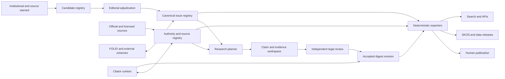

# Architecture: FOLIO-aligned digest from scratch — 2026-07-29

> **Document set:** [Runner proposals](2026-07-29-RUNNER_V3_PROPOSALS.md) ·
> [Architecture](2026-07-29-ARCHITECTURE_FOLIO_ALIGNED.md) ·
> [FOLIO/SKOS](2026-07-29-FOLIO_SKOS.md) ·
> [Research audit](2026-07-29-RESEARCH_METHOD_AUDIT.md) ·
> [Atomic plan](2026-07-29-TODO.md)
>
> **Scenario boundary:** no new digest articles or releases have been
> generated. The existing 137,139-row v3 issue ledger is candidate input and
> implementation evidence, not a lawyer-validated canonical registry.
>
> **Evidence snapshot:** runner
> `265a8610695067d825392751ffdb3e5932a0aefd`; site
> `3e49d34387d2d5ce20930cc158d01dc5c725b071`; measurement cutoff
> `2026-07-29T18:03:54Z`.

## Scope

This architecture assumes **zero generated digest articles and zero accepted
concepts** in the new edition. Existing code, the v3 candidate ledger, and
corpus artifacts are design evidence only.

`DONE` means a design decision is closed or a reusable component is evidenced.
`PENDING` means the greenfield system has not passed its acceptance test. Mixed
work is split into atomic rows.

## Governing architectural statement

> Build a jurisdiction-aware legal issue registry with opaque stable
> identifiers; use professional topic-entry vocabularies for access; represent
> doctrine as a reviewed polyhierarchical and associative graph; link each
> digest claim to versioned authority evidence; and map the local registry to
> FOLIO and other schemes without making any external vocabulary the operative
> taxonomy.

The architecture must preserve three different forms of value:

| Layer                            | Function                                                                                        | Ownership                                             |
| -------------------------------- | ----------------------------------------------------------------------------------------------- | ----------------------------------------------------- |
| Source and institutional warrant | Evidence that a term, distinction, issue, or research path is professionally used               | External sources, recorded with provenance and rights |
| Canonical issue registry         | Identity, scope, relationships, jurisdiction, language, editorial status, and version history   | Project editorial program                             |
| Interoperability mappings        | Qualified alignment to FOLIO, library vocabularies, legislative vocabularies, and local schemes | Project mapping assertions tied to external versions  |

These layers must not be collapsed. A law-library subject guide is evidence of
user vocabulary, not institutional endorsement. A historical digest heading is
literary warrant, not automatically a current legal issue. A FOLIO class is an
external semantic coordinate, not automatically the correct local parent. A
model classification is a candidate, not an editorial decision.

## Product boundary

### Digest

A digest organizes recurring legal issues, states rules and qualifications,
and points researchers to authorities.

### Citator

A citator tracks authority identity, history, citing references, treatment,
effective dates, amendments, repeal, and jurisdictional status.

### Architectural decision

| ID    | Status      | Decision                                                                                                      |
| ----- | ----------- | ------------------------------------------------------------------------------------------------------------- |
| A-001 | **DONE**    | The digest graph and authority/citator graph are separate bounded contexts joined by stable authority IDs.    |
| A-002 | **DONE**    | Digest pages may display reviewed citator data, but the absence of a treatment record never implies validity. |
| A-003 | **PENDING** | Implement and evaluate the citator context before using “KeyCite competitor” as a public claim.               |

The immediate competitive target is the professional issue-indexing value of
West Digests/Key Numbers and LexisNexis headnotes. KeyCite and Shepard's claims
require the separate citator acceptance gates in this document.

## Architecture at a glance



The only public artifacts are deterministic projections of accepted,
versioned records. Models never write directly to the publication tree.

## Current implementation evidence and architectural consequences

Snapshot: **2026-07-29**.

| Problem found                                                          | Evidence                                                                                                                                                                                                                                                                                                                                                                                                                                                                       | Cause                                                                                                             | Greenfield consequence                                                                                                              |
| ---------------------------------------------------------------------- | ------------------------------------------------------------------------------------------------------------------------------------------------------------------------------------------------------------------------------------------------------------------------------------------------------------------------------------------------------------------------------------------------------------------------------------------------------------------------------ | ----------------------------------------------------------------------------------------------------------------- | ----------------------------------------------------------------------------------------------------------------------------------- |
| The current identity ledger is large but unvalidated                   | 137,139 v3 issue records from 156,802 item rows; 1,607 merged issues; 10,177 multi-item issues; maximum 271 members                                                                                                                                                                                                                                                                                                                                                            | Deterministic construction and deduplication preceded specialist validation                                       | Treat the ledger as candidate warrant, not the new canonical registry                                                               |
| Current and v3 root systems diverge                                    | Physical tree: 31 current doctrinal plus 10 legacy composite roots; v3: 36 Areas of Law, five absent physically; naive coexistence yields 46 roots                                                                                                                                                                                                                                                                                                                             | Successive classification schemes accumulated in the filesystem                                                   | Reconcile candidate topics before any public browse release                                                                         |
| Concept IRIs change when paths change                                  | `digest-law-us/src/lib/skos.ts` builds `conceptIri(slugPath)`                                                                                                                                                                                                                                                                                                                                                                                                                  | Route and identity are the same string                                                                            | Mint opaque registry IRIs before routes                                                                                             |
| The publisher creates a mandatory folder-parent `skos:broader`         | `conceptFor()` unions frontmatter broader values with the structural parent                                                                                                                                                                                                                                                                                                                                                                                                    | Filesystem navigation was treated as ontology                                                                     | Browse projections cannot assert semantic relations                                                                                 |
| Published literals are English                                         | `langLit()` hard-codes `@language: "en"`                                                                                                                                                                                                                                                                                                                                                                                                                                       | Language was a site-level assumption                                                                              | Language belongs to each label/note                                                                                                 |
| Ingest accepts unknown/weak structures                                 | `src/content.config.ts` uses optional fields and `.passthrough()`                                                                                                                                                                                                                                                                                                                                                                                                              | Legacy publication compatibility                                                                                  | Strict canonical validation must happen upstream                                                                                    |
| Source filenames can be attached to the wrong source after a rejection | `save_research_output()` compacts successful `SaveRecord`s; `classify_retained_sources()` indexes them against the original source list                                                                                                                                                                                                                                                                                                                                        | Parallel arrays joined by position                                                                                | Every source snapshot needs an immutable ID                                                                                         |
| Provenance can disagree with disk                                      | The 2026-07-29 manifest audit found 48 missing inventory files across 26 bundles, 130 SHA mismatches across 69, 121 byte mismatches across 62, 154 retained-count mismatches, 855 disk files absent from inventories across 169, 166 declared-evidence-count mismatches, 169 evidence-list-length mismatches, 44 evidence filenames absent from disk across 24, 995 disk files absent from evidence records across 201, and source filename-set differences across 172 bundles | Files changed after manifest creation, and `build_manifest()` inventories only current `SaveRecord` paths         | Accepted revision and manifest must be one transaction                                                                              |
| Reruns can erase curation                                              | The TODO documents 985 of 3,010 historical topic directories written more than once                                                                                                                                                                                                                                                                                                                                                                                            | A mutable directory represented the current issue                                                                 | Revisions are immutable; publishing is pointer promotion                                                                            |
| The semantic graph is thin                                             | Current scan: 1,705 digest paths; 660 dedicated definitions, but 1,633 (95.8%) with either `definition` or legacy `description`; 668 scope notes; 159 with `related`; 135 with project legal relations; no parsed multi-`broader` examples                                                                                                                                                                                                                                     | Legacy descriptive fallback is broad, while dedicated semantic documentation and graph construction remain sparse | Semantic completeness is a pre-publication editorial gate                                                                           |
| Source hygiene is not topical relevance                                | `retention_gate()` expressly does not judge topicality                                                                                                                                                                                                                                                                                                                                                                                                                         | Deterministic host/length rules were the only blocking filter                                                     | Relevance and legal applicability need labeled evaluation and review                                                                |
| Source copies obscure identity and rights                              | 7,436 files contain 6,346 unique bodies; 1,090 duplicate body copies reclaim 526,940,196 bytes (32.67%); zero source frontmatter records declare license/rights/copyright/provenance/language and only eight declare jurisdiction                                                                                                                                                                                                                                              | Bundle-local files carry identity, content, and metadata together                                                 | Store one content-addressed snapshot with governed occurrences, rights, and safety decisions                                        |
| The site build depends on a private sibling checkout                   | `src/corpus.config.ts` and README                                                                                                                                                                                                                                                                                                                                                                                                                                              | Corpus and release artifact are not independently packaged                                                        | Publish only signed, self-describing releases                                                                                       |
| The site is not currently release-gated                                | Latest audit: `npm run check` OOM exit 134 near 4 GB; one lint error; 24 format failures; no test/coverage script; short CI does not load the corpus                                                                                                                                                                                                                                                                                                                           | Local scale constraints and legacy content were not encoded in a comprehensive CI contract                        | Qualify the greenfield publisher against the signed corpus with explicit heap, test, coverage, lint, format, build, and smoke gates |

## Canonical data model

### 1. Concept

A `Concept` represents a controlled-vocabulary entity. Required fields:

| Field                | Meaning                                                                                           |
| -------------------- | ------------------------------------------------------------------------------------------------- |
| `concept_id`         | Opaque UUID/ULID or equivalent permanent local identifier                                         |
| `scheme_id`          | Jurisdictional or cross-jurisdictional concept scheme                                             |
| `concept_kind`       | `topic`, `issue`, `doctrine_or_test`, `statutory_regime`, `controversy`, or another governed kind |
| `status`             | `candidate`, `reviewed`, `validated`, `deprecated`, `replaced`, or `disputed`                     |
| `jurisdiction_scope` | One or more normalized jurisdictions, or explicitly comparative/transnational                     |
| `temporal_scope`     | Current, historical period, effective interval, or unknown                                        |
| `created_in_version` | Registry version that minted the ID                                                               |
| `editorial_record`   | Decision, reviewer, date, basis, and change history                                               |

Labels, notes, relationships, and placements are separate versioned records.
They can change without changing `concept_id`.

### 2. Label and note

Each `Label` or `Note` records:

- concept ID;
- literal value;
- BCP 47 language tag;
- script when needed;
- jurisdiction or legal-system qualifier;
- type (`preferred`, `alternative`, `hidden`, `historical`, `definition`,
  `scope`, `editorial`, `change`, `example`);
- source or editorial warrant;
- status and validity interval; and
- reviewer decision.

There is at most one SKOS preferred label per concept and BCP 47 language tag.
Audience, jurisdiction, and usage preferences remain project label metadata;
they do not create additional same-language `skos:prefLabel` values.
Transliteration is an alternative label, not a silent replacement for a
local-script label.

### 3. Concept relation

Each relation is a first-class assertion:

- subject concept;
- predicate;
- object concept;
- scheme and jurisdiction context;
- assertion status;
- source/editorial warrant;
- reviewer;
- confidence used for routing only;
- created/superseded versions.

Required relation families:

- hierarchical: broader/narrower;
- associative: related;
- typed legal associations such as remedy-for, defense-to, exception-to,
  procedure-for, element-of, and governed-by;
- external mappings: exact, close, broad, narrow, or related; and
- version/lifecycle: replaces, split-from, merged-into, deprecated-by.

Typed legal relations are not automatically subproperties of `skos:related`
until the semantic implications are formally reviewed. Exporters may emit both
when explicitly configured.

### 4. Placement

A `Placement` is a navigational/editorial arrangement, not identity.

Fields include concept, scheme edition, parent placement, facet, primary or
alternate status, jurisdiction, audience, and sort order. A concept may have
multiple placements. A placement may be retired without deprecating the
concept.

This allows:

- a lawyer-facing topic browse;
- a librarian-facing classification view;
- an objective/task view;
- jurisdiction-specific arrangement;
- pedagogical arrangements; and
- stable concepts despite editorial reorganization.

### 5. Source record and source snapshot

`SourceRecord` identifies a work or official publication. `SourceSnapshot`
identifies exact bytes or normalized content at a time/version.

Required snapshot properties include:

- source and snapshot IDs;
- canonical and retrieval URLs;
- publisher/issuer;
- authority type;
- governed document kind, distinguishing opinions/orders from briefs,
  declarations, and other filings;
- jurisdiction;
- decision/publication/effective dates;
- version or amendment lineage;
- content type and character encoding;
- retrieval adapter and timestamp;
- raw and normalized hashes;
- segmentation coordinates;
- rights basis and redistribution decision; and
- privacy, sensitivity, and redaction disposition; and
- integrity validation.

The public retained-source artifact, if permitted, is a projection of the
snapshot. Its filename has no identity function.

### 6. Authority

An `Authority` normalizes a case, constitution, statute, regulation, court
rule, treaty, administrative decision, or other legally operative instrument.
It can have multiple citations and many snapshots/versions.

An authority record is distinct from:

- the web page from which it was retrieved;
- a citation string;
- a source snapshot;
- a legal issue; and
- a claim about its treatment.

### 7. Digest claim

A `DigestClaim` is the smallest reviewable proposition. It records:

- stable claim ID within a digest lineage;
- issue and digest revision;
- claim type;
- text;
- jurisdiction and temporal applicability;
- cited authority IDs;
- evidence-span IDs;
- contrary/limiting claims;
- generation provenance;
- reviewer disposition and reasoning; and
- supersession.

The prose digest is an ordered rendering of claims and transitions. This design
allows a reviewer to reject one proposition without discarding an entire
research run.

### 8. Evidence span

An `EvidenceSpan` links a claim to exact content:

- source snapshot ID;
- character/byte offsets or robust selector;
- quoted text hash;
- pinpoint citation;
- extraction method;
- entailment/adjudication result; and
- reviewer.

The span survives source-file renaming and detects source-content drift.

### 9. Run, review, and release

`RunAttempt`, `EditorialReview`, and `Release` are distinct records.

- A run records what machines attempted.
- A review records what qualified people decided.
- A release records the exact accepted entity versions and generated files.

Operational provenance never substitutes for editorial validity.

## Identity and URI policy

| ID    | Status      | Requirement                                                                                                          |
| ----- | ----------- | -------------------------------------------------------------------------------------------------------------------- |
| ID-01 | **DONE**    | Opaque local concept identity is the architectural choice.                                                           |
| ID-02 | **PENDING** | Choose and document the identifier algorithm and collision policy.                                                   |
| ID-03 | **PENDING** | Establish a permanent IRI namespace independent of label, path, host, language, and jurisdictional browse placement. |
| ID-04 | **PENDING** | Implement a route registry mapping human-readable routes to concept IDs.                                             |
| ID-05 | **PENDING** | Implement redirect history for every retired route.                                                                  |
| ID-06 | **PENDING** | Implement immutable source-snapshot, authority, claim, run, review, and release IDs.                                 |

Recommended concept IRI shape:

```text
https://w3id.org/digest-law/concept/{opaque-id}
```

Recommended human page shape:

```text
https://digest.law/{locale}/{jurisdiction}/{human-route}/
```

The canonical IRI identifies the concept. The page URL is a negotiable view.
HTTP behavior and content negotiation must be tested, documented, and
version-independent.

Use a stable jurisdictional scheme IRI such as
`https://w3id.org/digest-law/scheme/us` and a distinct immutable release IRI
such as `https://w3id.org/digest-law/release/us/2027.1`. Concepts remain in the
stable scheme; release membership is recorded separately.

## Concept formation and hierarchy

### Atomic type decisions

| ID    | Status      | Decision                                                                                                                          |
| ----- | ----------- | --------------------------------------------------------------------------------------------------------------------------------- |
| KO-01 | **DONE**    | A heading is candidate evidence, not automatically an issue.                                                                      |
| KO-02 | **DONE**    | Practice areas and professional access labels are `topic` concepts or placements.                                                 |
| KO-03 | **DONE**    | Recurring legal questions, rules, elements, defenses, remedies, and procedures may be `issue` concepts.                           |
| KO-04 | **DONE**    | Named statutes such as Dodd-Frank may be `statutory_regime` access concepts; narrower legal questions remain issues.              |
| KO-05 | **DONE**    | Cases such as _Trump v. Hawaii_ are authorities, not issues. A recurring controversy may be a separately typed discovery concept. |
| KO-06 | **DONE**    | “Introduction,” “In General,” “Scope,” and equivalent organizational headings default to scaffold candidates.                     |
| KO-07 | **DONE**    | Polyhierarchy is permitted and expected.                                                                                          |
| KO-08 | **DONE**    | Associative relations are required for a mature release.                                                                          |
| KO-09 | **PENDING** | Publish the editorial handbook with positive, negative, and boundary examples for every concept kind.                             |
| KO-10 | **PENDING** | Construct and independently adjudicate the topic-entry layer.                                                                     |
| KO-11 | **PENDING** | Validate cycle-free hierarchical projections and separately validate associative/typed relations.                                 |

### Why a 400–700 topic entry layer is compatible with rigor

The first visible layer is an access vocabulary, not a philosophical division
of all law. It should resemble the labels lawyers and law libraries already use
to begin research while preserving more precise issue concepts underneath.
Each entry topic must have multiple independent warrants and a documented
scope. No institution's public list is copied wholesale or represented as an
endorsement.

The former 13-domain model may remain as an optional high-level collection if
reviewers find it useful. It must not be the mandatory semantic parent of every
issue.

## FOLIO alignment

### Role

FOLIO provides OWL classes and a federation-friendly semantic reference plane.
It is not documented as a SKOS ConceptScheme. The local registry remains
authoritative for digest issue identity, labels, scope, hierarchy, and
editorial status.

### Required mapping record

Each mapping assertion records:

- local concept ID and version;
- external IRI;
- target RDF type;
- compatibility policy;
- project relation or, when justified, SKOS mapping predicate;
- external repository, commit/release, artifact hash, and license;
- mapping rationale;
- mapping method;
- reviewer;
- date;
- status and supersession.

### Mapping safeguards

| ID   | Status      | Requirement                                                                                                                                                                     |
| ---- | ----------- | ------------------------------------------------------------------------------------------------------------------------------------------------------------------------------- |
| F-01 | **DONE**    | FOLIO does not replace the local operative taxonomy.                                                                                                                            |
| F-02 | **DONE**    | Bare external IDs are insufficient provenance.                                                                                                                                  |
| F-03 | **PENDING** | Pin the exact FOLIO artifact used for the new scheme.                                                                                                                           |
| F-04 | **PENDING** | Review each mapping relation semantically; area and objective proximity cannot default to `closeMatch`.                                                                         |
| F-05 | **PENDING** | Validate mapping cardinality, flag redundant explicit exact-plus-close assertions, and reject exact mappings combined with disjoint broad/narrow/related mappings.              |
| F-06 | **PENDING** | Preserve mappings when browse placements change.                                                                                                                                |
| F-07 | **PENDING** | Publish attribution and machine-readable license metadata in every release.                                                                                                     |
| F-08 | **PENDING** | Emit `skos:*Match` only to an approved pinned SKOS proxy/view or under an explicit reviewed dual-typing policy; otherwise preserve the OWL-class target in a project assertion. |

## Multilingual and multi-jurisdiction architecture

International replication is a method, not translation of the U.S. tree.

### Jurisdiction model

Every claim, authority, concept scope, placement, and editorial decision has an
explicit jurisdiction context. Jurisdiction must support:

- country;
- federation member/state/province;
- court or tribunal system;
- supranational and international regimes;
- indigenous, religious, customary, or mixed systems when locally applicable;
- conflict-of-laws/comparative concepts; and
- temporal change.

No folder name or language tag may stand in for jurisdiction.

### Language model

Every natural-language literal carries a BCP 47 language tag; identifiers,
dates, numbers, and other typed values do not. The system distinguishes:

- translation;
- local doctrinal equivalent;
- transliteration;
- historical label;
- practitioner synonym;
- library term; and
- non-equivalence explained by a scope note.

An English term and a foreign-language term are not `exactMatch` merely because
a bilingual dictionary aligns them. Comparative mapping requires local legal
review.

### Jurisdiction build kit

Each new jurisdiction receives:

1. source and rights inventory;
2. public professional vocabulary inventory;
3. local topic-entry proposal;
4. concept-kind handbook adapted to the legal system;
5. authority adapters;
6. local citation parser and court/issuer registry;
7. bilingual or local-language label policy;
8. lawyer and law-librarian review panel;
9. gold-set evaluation;
10. SKOS/FOLIO/external mapping review; and
11. independent release governance.

| ID   | Status      | Requirement                                                                                                    |
| ---- | ----------- | -------------------------------------------------------------------------------------------------------------- |
| J-01 | **DONE**    | Jurisdiction-specific construction, not U.S.-tree translation, is the chosen method.                           |
| J-02 | **PENDING** | Implement the jurisdiction registry and temporal model.                                                        |
| J-03 | **PENDING** | Implement language-tagged labels/notes throughout storage, APIs, exports, search, and UI.                      |
| J-04 | **PENDING** | Select a second-jurisdiction pilot using source access and local expert availability, not marketability alone. |
| J-05 | **PENDING** | Run independent local evaluation before cross-jurisdiction publication.                                        |

## Rights and provenance architecture

Rights are evaluated at three levels:

1. the underlying legal or editorial work;
2. the exact source snapshot or database extraction;
3. the project's selection, arrangement, annotations, mappings, and digest
   text.

Private products may inform functional benchmarking and professional method,
but proprietary headnotes, key numbers, citator labels, or protected
selection/arrangement must not be redistributed or silently used as training
ground truth without a documented lawful basis.

| ID     | Status      | Requirement                                                                                                                          |
| ------ | ----------- | ------------------------------------------------------------------------------------------------------------------------------------ |
| RGT-01 | **DONE**    | Public accessibility is not a rights determination.                                                                                  |
| RGT-02 | **PENDING** | Create a per-snapshot rights schema and release policy.                                                                              |
| RGT-03 | **PENDING** | Obtain counsel review for source classes and structural contamination risks.                                                         |
| RGT-04 | **PENDING** | Make PD/open/restricted research partitions reproducible.                                                                            |
| RGT-05 | **PENDING** | Include machine-readable provenance and rights in bulk exports and source pages.                                                     |
| RGT-06 | **PENDING** | Apply a distinct privacy/sensitivity review to filings and personal records; lawful access is not automatic permission to republish. |

## Revision, curation, and governance

### Immutable revision rule

An accepted digest revision is never edited in place. Correction produces a
new revision linked to the old one. Publication promotes a release pointer.
Withdrawal preserves the identifier and reason.

### Editorial states

Candidate → researched → machine-validated → independently reviewed →
adjudicated → accepted → published → superseded/deprecated/disputed.

These are not all “statuses” on one mutable file. Each transition is an event
with actor, time, inputs, checks, and reason.

### Governance bodies

- editorial board: issue scope, relationships, labels, releases;
- jurisdiction panels: local doctrinal decisions;
- law-library panel: warrant, access vocabulary, mappings, usability;
- technical standards group: schemas, identifiers, SKOS/SHACL, releases;
- rights and ethics review: sources, licensing, sensitive material;
- public correction process: reported errors and transparent disposition.

| ID     | Status      | Requirement                                                                              |
| ------ | ----------- | ---------------------------------------------------------------------------------------- |
| GOV-01 | **PENDING** | Publish editorial roles, conflicts policy, reviewer qualification, and appeal procedure. |
| GOV-02 | **PENDING** | Implement immutable revision and release promotion.                                      |
| GOV-03 | **PENDING** | Publish change logs at concept, digest, authority, and release levels.                   |
| GOV-04 | **PENDING** | Establish scheduled blind audits and reviewer-drift checks.                              |
| GOV-05 | **PENDING** | Define urgent correction and withdrawal service levels.                                  |

## Required technical components

Reusable prototype evidence is recorded separately so it is not confused with
greenfield completion:

| Prototype capability                       | Status   | Evidence                                                                        |
| ------------------------------------------ | -------- | ------------------------------------------------------------------------------- |
| Human-page and JSON-LD publisher pattern   | **DONE** | Existing site renders pages, paginated sources, search, provenance, and JSON-LD |
| Local and append-only run-manifest pattern | **DONE** | Existing runner writes `run.json` and `runs.jsonl`                              |
| Fail-closed Markdown/OKF lint pattern      | **DONE** | Existing runner validates file shape before write                               |

Every required greenfield component remains independently pending:

| Component                      | Status      | Responsibility                                                                                | Acceptance                                                                                      |
| ------------------------------ | ----------- | --------------------------------------------------------------------------------------------- | ----------------------------------------------------------------------------------------------- |
| Canonical registry database    | **PENDING** | Concepts, labels, placements, relations, authorities, claims, reviews, revisions              | Transactional constraints and migration tests pass                                              |
| Candidate intake service       | **PENDING** | Warrant ingestion without public minting                                                      | Duplicate/scaffold/rights decisions are explicit                                                |
| Work ledger                    | **PENDING** | Leases, retries, budgets, state transitions                                                   | Crash and concurrency tests pass                                                                |
| Source adapter SDK             | **PENDING** | Typed official-source acquisition                                                             | Contract suite passes for every adapter                                                         |
| Evidence store                 | **PENDING** | Immutable snapshots and spans                                                                 | Hash and selector verification passes                                                           |
| Research planner               | **PENDING** | Jurisdiction- and issue-aware query plans                                                     | Plan coverage measured on gold set                                                              |
| Claim builder                  | **PENDING** | Structured propositions with evidence                                                         | No unsupported accepted claim                                                                   |
| Review workspace               | **PENDING** | Blind review and adjudication                                                                 | Independence and audit logging enforced                                                         |
| Registry API                   | **PENDING** | Versioned read and editorial interfaces                                                       | Auth, schema, pagination, and consistency tests pass                                            |
| Export service                 | **PENDING** | Markdown, HTML, SKOS, JSON-LD, RDF, indexes                                                   | Projection parity and SHACL pass                                                                |
| Release builder                | **PENDING** | Signed immutable releases                                                                     | Clean reproducible build passes                                                                 |
| Greenfield public publisher    | **PENDING** | Render accepted releases with human pages, source pagination, search, provenance, and JSON-LD | Opaque IDs, strict schema, multilingual data, signed-release input, tests, and scale gates pass |
| Transactional manifest service | **PENDING** | Bind run, revision, files, sources, and release membership                                    | Independent reconstruction has zero missing, extra, or mismatched entries                       |
| Canonical-data validator       | **PENDING** | Validate structured records before any projection                                             | Schema, SHACL, semantic, and negative fixtures fail closed                                      |

## Required non-functional gates

| Quality                  | Status      | Gate                                                                                                                                                                |
| ------------------------ | ----------- | ------------------------------------------------------------------------------------------------------------------------------------------------------------------- |
| Legal accuracy           | **PENDING** | Stratified lawyer review clears predeclared claim and classification thresholds                                                                                     |
| Evidence integrity       | **PENDING** | 100% of material public legal claims resolve to verified source spans; synthesis is a typed inference over supported premises; unsupported leads remain quarantined |
| Identity stability       | **PENDING** | Rename/reparent/localize tests preserve canonical IDs                                                                                                               |
| Reproducibility          | **PENDING** | Independent clean build reproduces release hashes                                                                                                                   |
| Rights                   | **PENDING** | Every public byte has a release eligibility decision                                                                                                                |
| Accessibility            | **PENDING** | WCAG 2.2 AA automated and manual checks; print review                                                                                                               |
| Security                 | **PENDING** | Threat model, dependency scanning, secret isolation, signed artifacts                                                                                               |
| Reliability              | **PENDING** | Adapter failure isolation, retry budgets, idempotency, recovery drills                                                                                              |
| Performance              | **PENDING** | Budgeted build, API, search, and page metrics at target scale                                                                                                       |
| Observability            | **PENDING** | Per-stage success/error/quality metrics without exposing restricted content                                                                                         |
| Multilingual correctness | **PENDING** | Language tags, local review, script/search behavior, no silent fallback                                                                                             |
| Data portability         | **PENDING** | Versioned open exports with documented licenses and migrations                                                                                                      |

## Good-to-have architecture

| ID    | Status      | Capability                                   | Why                                                                    |
| ----- | ----------- | -------------------------------------------- | ---------------------------------------------------------------------- |
| GA-01 | **PENDING** | Event-sourced editorial history              | Makes reconstruction and audit easier than mutable audit columns       |
| GA-02 | **PENDING** | Offline-first reviewer client                | Helps expert panels with weak connectivity and sensitive drafts        |
| GA-03 | **PENDING** | Federated jurisdiction hosting               | Lets local institutions govern their own scheme while mapping globally |
| GA-04 | **PENDING** | Provenance graph using PROV-O                | Improves standards interoperability beyond release JSON                |
| GA-05 | **PENDING** | IIIF-style source selectors where applicable | More durable evidence anchoring for paginated scans                    |
| GA-06 | **PENDING** | Public SPARQL endpoint                       | Useful to researchers after operational and abuse controls mature      |
| GA-07 | **PENDING** | Change subscriptions/webhooks                | Supports downstream update workflows                                   |
| GA-08 | **PENDING** | Cross-lingual candidate discovery            | Surfaces mapping candidates while keeping local review authoritative   |

## Architecture completion rule

The architecture is ready for pilot generation only when all required
components through the review workspace are **DONE**, all required quality
gates have executable tests, and the release builder can produce an empty but
fully valid scheme. An empty valid release is the first milestone. The first
generated digest is the next one.
